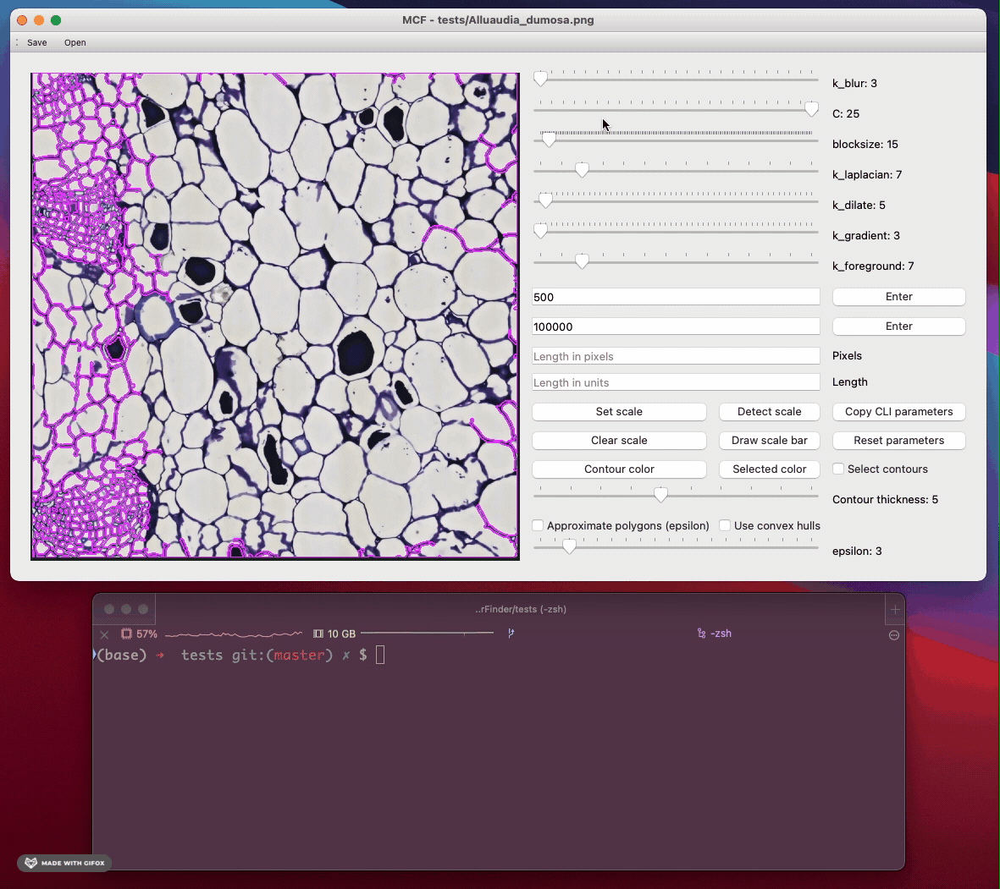

=============
Using the CLI
=============
The MiniContourFinder GUI is great for images less than ~75Mb and for working with a few images at a time. If you're working with large, high resolution images, or need to analyze dozens or hundreds of images, you'll want to take advantage of the MiniContourFinder CLI.

You can pull up the help screen by opening up a terminal and running 

.. code-block:: bash
    
    $ mcf

or by adding the ``-h`` or ``--help`` flag.

.. code-block:: bash

       __  ___   _          _               
      /  |/  /  (_)  ___   (_)               
     / /|_/ /  / /  / _ \ / /               
    /_/__/_/  /_/  /_//_//_/                
     / ___/ ___   ___  / /_ ___  __ __  ____
    / /__  / _ \ / _ \/ __// _ \/ // / / __/ 
    \___/__\___//_//_/\__/ \___/\_,_/ /_/   
      / __/  (_)  ___  ___/ / ___   ____    
     / _/   / /  / _ \/ _  / / -_) / __/    
    /_/    /_/  /_//_/\_,_/  \__/ /_/       
                                        

    usage: MCF.py [-h] [-i] [-o] [-p] [-D] [-d] [--debug DEBUG] [-n] [-kb] [-c]
            [-B] [-kl] [-kd] [-kg] [-kf] [-a] [-A]

    optional arguments:
    -h, --help            show this help message and exit
    -i , --input          filepath to query image
    -o , --output_dir     path to output directory. Default='./'
    -p , --prefix         new prefix for output files. By default the new files
                        will reflect the input file's basename
    -D , --detectScaleBar 
                        automated scale bar detection. Default=False
    -d , --dpi            Output image resolution in pixels. Default=300
    --debug DEBUG         writes debugging information and plots more steps
    -n , --neighborhood   neighborhood size in pixels determining a unique
                        contour. Default=10
    -kb , --k_blur        blur kernel size; must be odd. Default=9
    -c , --C              constant subtracted from mean during adaptive Gaussian
                        smoothing. Default=3
    -B , --blocksize      neighborhood size for calculating adaptive Gaussian
                        threshold; must be odd. Default=15
    -kl , --k_laplacian   Laplacian kernel size; must be odd. Default=5
    -kd , --k_dilate      dilation kernel size; must be odd. Default=5
    -kg , --k_gradient    gradient kernel size; must be odd. Default=3
    -kf , --k_foreground 
                        Foregound clean up kernel size; must be odd. Default=7
    -a , --Amin           Minimum contour area in pixel
    -A , --Amax           Maximum contour area in pixels

Without some knowledge of what all these flags do, it can be difficult to get the segmentation right, which I why I recommend starting out with the GUI and migrating to the CLI once you've dialed in the parameter values.

In particular, once you've selected some parameters that you like, you can use the "Generate CLI parameters", which copies the formatted parameter values to your clipboard so they can be pasted into a terminal.

