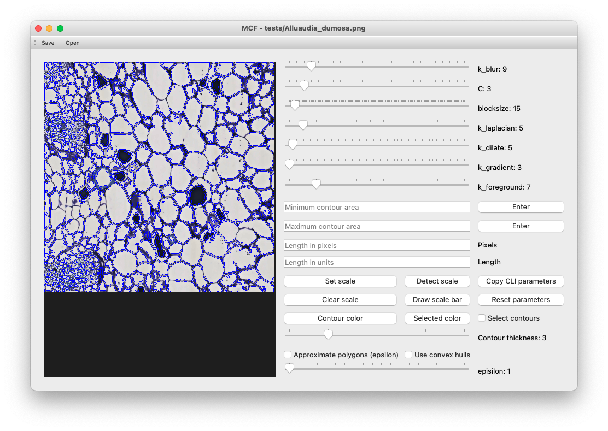
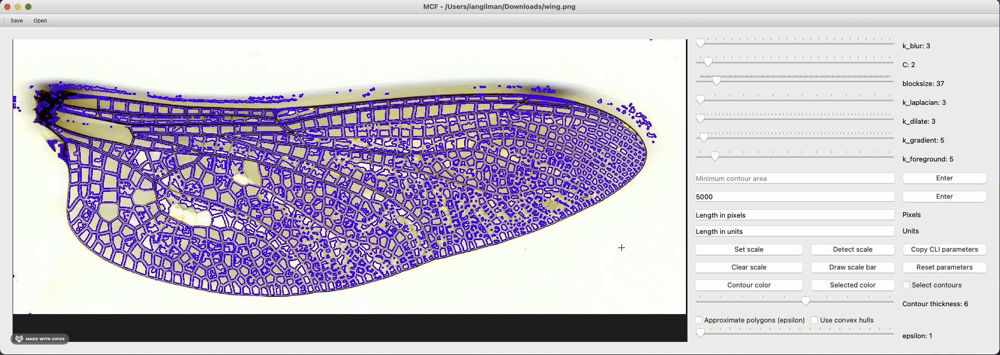
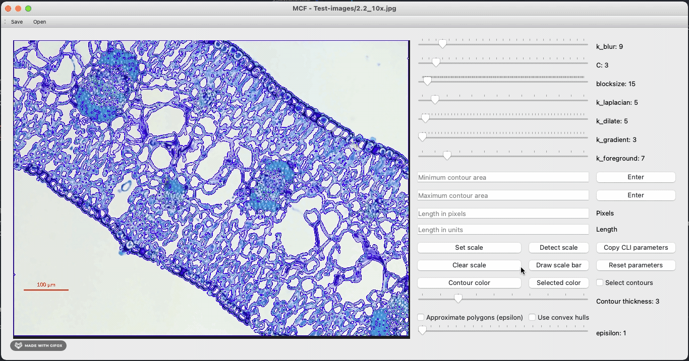
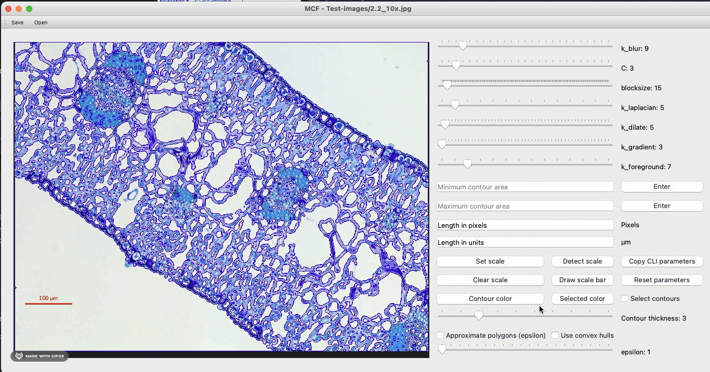

=============
Using the GUI
=============
MiniContourFinder, and the GUI in particular, were designed with the idea that the user need not understand the image processing steps under the hood to produce great image segmentations. I'll briefly review the image operations at the end of this section, but they aren't necessary to get going.

###########################
Segmenting your first image
###########################

I'll be working with a cross sectional image of the stem of an *Alluaudia dumosa* called ``Alluaudia_dumosa.png``. You can follow along by using the same image, which is included in the test data installed with MiniContourFinder, and available on in the repo `here <https://github.com/isgilman/MiniContourFinder/blob/master/tests/Alluaudia_dumosa.png>`_. Getting started with the GUI is as easy as

.. code-block:: bash

    $ mcf-gui Alluaudia_dumosa.png

A message about image denoising should appear in the terminal, followed by a window like the one below. In an effort to reduce the start-up time for users working with the same image, a denoised image is created in the working directory (``*.denoise.png``). You can safely delete this file anytime, but it will save you time when reanalyzing an image, especially when working with images over 50Mb.

.. warning::
    The MiniContourFinder GUI performs better on smaller images, and will be slow to react when working with images over 75Mb. If you'd like to segment large images, I suggest refining parameters on a section of the image and then feeding those parameters through the command line interface. See more `here <file:///Users/iangilman/Dropbox/GitHub_repos/MiniContourFinder/docs/_build/html/cliguide.html>`_.

The blue lines in the image are the current contours, which you can tweak by moving the sliders. It can be difficult to see the blue contours against the blue-stained image. You can zoom in and out using ``cmd`` + ``+`` and ``cmd`` + ``-``, respectively, and you can change the color of the contours by clicking "Contour color". You can also choose minimum and maximum contour sizes to get ride of unwanted contours that are often capturing dust on a microscope slide or enclose the entire image. 

.. image:: images/AD_GUI_pink_setArea.png
    :width: 600

You can see that we've lost many unwanted small contours, but we've also lost many contours that initially looked good because they were not completely separated from one another. A few quick adjustments of the sliders and refinements of the minimum and maximum area produce a very clean segmentation.

.. image:: images/AD_GUI_good_segments.png
    :width: 600

Now we're ready to select some of these contour for inclusion in our final data set. The default color for selected contours is magenta, so I first changed my selected color to green using the "Selected color" button. Then I added contours by checking the "Select contours" box in the lower left, and left-clicking individual contours, or group selecting multiple contours by left-clicking and dragging over an area. Contours can be removed in the same way, but by using right-click or right-click and drag.

.. image:: images/AD_GUI_selection.gif
    :width: 600

You won't be able to alter segmentation parameters while you're selecting contours because all contours that you select are saved with their parameter metadata so that they can be reproduced easily. Not all areas of the image may be equally well segmented, so once you've selected all the contours that you like, you can uncheck "Select contours", adjust parameters, and repeat.

###########################
Saving and loading contours
###########################

You can save the contours from MiniContourFinder by using the "Save" menu tab, or hitting ``cmd`` + ``s``.

.. note::
    You should enter a **prefix** at the save pop-up, not a full full file name with extention

MiniContourFinder will save four files:

- ``prefix.contour_data.csv`` a data frame in ``csv`` format containing, for each contour,
  
  - a unique identifier (``uuid4``)
  - the contour itself
  - the parameter metadata when the contour was selected (``C``, ``kBlur``, ``blocksize``, ``kLaplacian``, ``kDilate``, ``kGradient``, and ``kForeground``)
  - shape metrics (area in pixels, moment, minimum enclosing circle, minimum bounding box, aspect ratio, convex hull, convexity, solidity, and equivalent diameter)
  
- ``prefix.contour_data.json`` the same data as ``prefix.contour_data.csv`` in ``json`` format
- ``prefix.pdf`` an image of the selected contours over laid on the input image and annotated according to the ``prefix.contour_data.*`` files
- ``prefix.noindex.pdf`` an image of the selected contours ocer laid on the input image with no annotation

By default, MiniContourFinder will export the selected contours, if you haven't selected any contours then it will export all current contours.

.. tip::
    You can export all current contours by saving with no contours selected.

The ``csv`` is intended to be more human readable, but the ``json`` file is the one MiniContourFinder needs when loading contours. You can load contours using the "Open" menu tab, or with ``cmd`` + ``o``. Opening contours will automatically put MiniContourFinder in selection mode and add the imported contours to the list of selected contours.

###################
Additional features
###################

**********************
Contour approximations
**********************
MiniContourFinder can apply two approximations that may be useful in certain contexts, approximate polygons and convex hulls. These can be useful when either the exact shape is not important, for example, when counting objects, or if the segments have straight or regular, rather than curved or irregular boundaries. I'll use an image of a `dragonfly wing <https://github.com/hoffmannjordan/insect-wing-venation-patterns/blob/master/ims/wing.png>`_ from Jordan Hoffman that was part of Salcedo *et al.* (2019).

Here, by checking "Use convex hulls" we better approximate the dragonfly wing segments that were a little noisy.

Approximate polygons are similar to convex hulls but allow the segments to be concave. By checking "Approximate polygons" and increasing ``epsilon``, we approximate the contour by a polygon with fewer and fewer edges.

.. image:: images/DF_approx_polys.gif
    :width: 600

******************
Adding a scale bar
******************

If your image contains a scale bar, you can use the "Detect scale bar" to automatically detect it. This works well with line-like scale bars, like in the image below.

You can see in this case that MiniContourFinder correctly detected the scale bar (in green on the lower left) and read the units, all of which should update on the right hand panel once you interact with the GUI again. If detection isn't working, which is often the case when scale bars are not distinct from the focal parts of the image, a scale bar can be drawn manually.

.. note::
    All scale bars and measurements are relative to the original image size, regardless of how large the viewing window is.

Alternatively, if you already know the conversion from pixels to another unit, that can be entered into the appropriate fields. 

.. tip::
    If MiniContourFinder is provided with conversion information and units it will convert pixel-based areas when exporting contour data.

############################
Understanding the parameters
############################
Segmentation in MiniContourFinder is accomplished through a combination of `smoothing <https://docs.opencv.org/4.5.2/d4/d13/tutorial_py_filtering.html>`_, `thresholding <https://docs.opencv.org/4.5.2/d7/d4d/tutorial_py_thresholding.html>`_, and `morphological operations <https://docs.opencv.org/4.5.2/d9/d61/tutorial_py_morphological_ops.html>`_. The image (A) is first denoised using non-local means (Buades et al. 2011), converted to grayscale, and undergoes adaptive histogram normalization to increase contrast (B). Then, the image is adaptively blurred to augment the contiguity of boundaries (C). Blurring is accomplished with a Gaussian filter over an area of ``k_blur`` x ``k_blur`` (:math:`k_{blur} \in 2\mathbb{N}+1`) centered on a pixel. The pixel's value is replaced with the Gaussian-weighted sum of its neighbors defined by the ``k_blur`` x ``k_blur`` surrounding area. Therefore, increasing ``k_blur`` reduces the effects of nearby pixels and increases the effects of far away pixels.

.. image:: images/Figure-1a-c.pdf
    :width: 600

Similar to blurring, the threshold, Laplacian, dilation, gradient, and foreground operators are applied over a kernel of size ``k`` x ``k`` (:math:`k \in 2\mathbb{N}+1`), where ``k`` determines the influence of pixels at different distances. 

An adaptive Gaussian threshold is taken to further increase line contrast (D); in the case of thresholding, each pixels new value is given by the Gaussian-weighted sum of the ``blocksize`` x ``blocksize`` kernel, minus the constant ``C``. Next, a Laplacian operator, which acts as a high pass filter, is applied to sharpen the edges in the image (E), and the image is dilated to expand boundaries (F). Dilating takes the value of a pixel to ``1`` if any pixel in the kernel is ``1``.

.. image:: images/Figure-1d-f.pdf
    :width: 600
    
The gradient is taken to remove space within hollow contours (G), and the result is binarized (H).

.. image:: images/Figure-1g-i.pdf
    :width: 600

Finally, the background (non-contour) is cleaned through morphological opening (erosion followed by dilation) (I) and closing (dilation followed by erosion) (J). Erosion is the opposite of dilation: the pixel is set to ``0`` if any other pixel in the kernal is ``0``. In an effort to only capture entire objects through segmentation, the image is flooded from the outside (K), which removes any partial shapes. Contours are then detected, with only the outermost contour returned in the case that contours are detected within one another (L).

.. image:: images/Figure-1j-l.pdf
    :width: 600

################
Literature cited
################

- Buades, A., Coll, B. & Morel, J.-M. Non-Local Means Denoising. Image Processing On Line 1, 208–212 (2011).
- Mary K. Salcedo, Jordan Hoffmann, Seth Donoughe, L. Mahadevan; Computational analysis of size, shape and structure of insect wings. Biol Open 15 October 2019; 8 (10): bio040774. doi: https://doi.org/10.1242/bio.040774