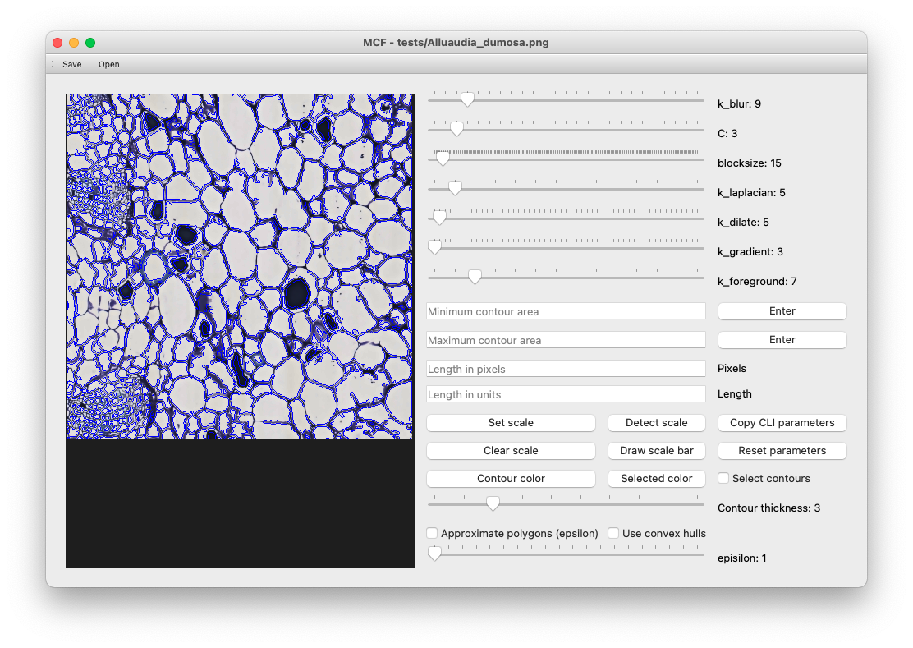

*************
Using the GUI
*************
MiniContourFinder, and the GUI in particular, were designed with the idea that the user need not understand the image processing steps under the hood to produce great image segmentations. I'll briefly review the image operations at the end of this section, but they aren't necessary to get going.

Throughout the docs, I'll be working with a cross sectional image of the stem of an *Alluaudia dumosa* called ``Alluaudia_dumosa.png``. You can follow along by using the same image, which is included in the test data installed with MiniContourFinder, and available on in the repo `here <https://github.com/isgilman/MiniContourFinder/blob/master/tests/Alluaudia_dumosa.png>`_. Getting started with the GUI is as easy as

.. code-block:: bash

    $ mcf-gui Alluaudia_dumosa.png

This should pull up a window like the one below

